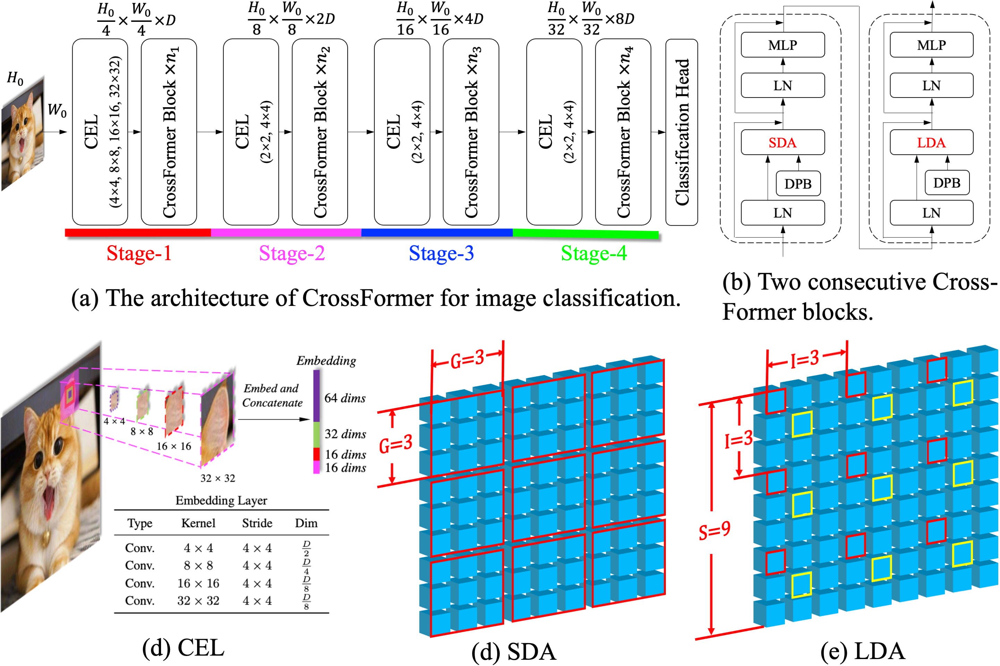

# CrossFormer

This repository is the code for our paper [CrossFormer: A Versatile Vision Transformer Based on Cross-scale Attention](https://arxiv.org/pdf/2108.00154.pdf)

(**ICLR 2022 Acceptance**).

Authors: [Wenxiao Wang](https://www.wenxiaowang.com), Lu Yao, [Long Chen](https://zjuchenlong.github.io/), Binbin Lin, [Deng Cai](http://www.cad.zju.edu.cn/home/dengcai/), [Xiaofei He](http://www.cad.zju.edu.cn/home/xiaofeihe/), Wei Liu

## Updates

- [x] Mask-RCNN detection/instance segmentation results with 3x training schedule.
- [x] Cascade Mask-RCNN detection/instance segmentation results with 3x training schedule.
- [x] The usage of `get_flops.py` in detection and segmentation.
- [x] Upload the pretrained CrossFormer-L.


## Introduction

Existing vision transformers fail to build attention among objects/features of different scales (cross-scale attention), while such ability is very important to visual tasks. **CrossFormer** is a versatile vision transformer which solves this problem. Its core designs contain **C**ross-scale **E**mbedding **L**ayer (**CEL**), **L**ong-**S**hort **D**istance **A**ttention (**L/SDA**), which work together to enable cross-scale attention.

**CEL** blends every input embedding with multiple-scale features. **L/SDA** split all embeddings into several groups, and the self-attention is only computed within each group (embeddings with the same color border belong to the same group.).



Further, we also propose a dynamic position bias (DPB) module, which makes the effective yet inflexible relative position bias apply to variable image size.

Now, experiments are done on four representative visual tasks, *i.e.*, image classification, objection detection, and instance/semantic segmentation. Results show that CrossFormer outperforms existing vision transformers in these tasks, especially in dense prediction tasks (*i.e.*, object detection and instance/semantic segmentation). We think it is because image classification only pays attention to one object and large-scale features, while dense prediction tasks rely more on cross-scale attention.


## Prerequisites

1. Libraries (Python3.6-based)
```bash
pip3 install numpy scipy Pillow pyyaml torch==1.7.0 torchvision==0.8.1 timm==0.3.2
```
2. Dataset: ImageNet

3. Requirements for detection/instance segmentation and semantic segmentation are listed here: [detection/README.md](./detection/README.md) or [segmentation/README.md](./segmentation/README.md)


## Getting Started

### Training
```bash
## There should be two directories under the path_to_imagenet: train and validation

## CrossFormer-T
python -u -m torch.distributed.launch --nproc_per_node 8 main.py --cfg configs/tiny_patch4_group7_224.yaml \
--batch-size 128 --data-path path_to_imagenet --output ./output

## CrossFormer-S
python -u -m torch.distributed.launch --nproc_per_node 8 main.py --cfg configs/small_patch4_group7_224.yaml \
--batch-size 128 --data-path path_to_imagenet --output ./output

## CrossFormer-B
python -u -m torch.distributed.launch --nproc_per_node 8 main.py --cfg configs/base_patch4_group7_224.yaml 
--batch-size 128 --data-path path_to_imagenet --output ./output

## CrossFormer-L
python -u -m torch.distributed.launch --nproc_per_node 8 main.py --cfg configs/large_patch4_group7_224.yaml \
--batch-size 128 --data-path path_to_imagenet --output ./output
```

### Testing
```bash
## Take CrossFormer-T as an example
python -u -m torch.distributed.launch --nproc_per_node 1 main.py --cfg configs/tiny_patch4_group7_224.yaml \
--batch-size 128 --data-path path_to_imagenet --eval --resume path_to_crossformer-t.pth
```

Training scripts for objection detection: [detection/README.md](./detection/README.md).

Training scripts for semantic segmentation: [segmentation/README.md](./segmentation/README.md).


## Results

### Image Classification

Models trained on ImageNet-1K and evaluated on its validation set. The input image size is 224 x 224.

| Architectures | Params | FLOPs | Accuracy | Models |
| ------------- | ------: | -----: | --------: | :---------------- |
| ResNet-50 | 25.6M | 4.1G | 76.2% |      -        |
| RegNetY-8G | 39.0M | 8.0G | 81.7% |     -        |
| **CrossFormer-T** | **27.8M**  | **2.9G**  | **81.5%**    | [Google Drive](https://drive.google.com/file/d/1YSkU9enn-ITyrbxLH13zNcBYvWSEidfq/view?usp=sharing)/[BaiduCloud](https://pan.baidu.com/s/1M45YXZgVvp6Ew9DO8UhdlA), key: nkju |
| **CrossFormer-S** | **30.7M**  | **4.9G**  | **82.5%**    | [Google Drive](https://drive.google.com/file/d/1RAkigsgr33va0RZ85S2Shs2BhXYcS6U8/view?usp=sharing)/[BaiduCloud](https://pan.baidu.com/s/1Xf4MXfb_soCnJFBeNDmoQQ), key: fgqj |
| **CrossFormer-B** | **52.0M**  | **9.2G**  | **83.4%**    | [Google Drive](https://drive.google.com/file/d/1bK8biVCi17nz_nkt7rBfio_kywUpllSU/view?usp=sharing)/[BaiduCloud](https://pan.baidu.com/s/1f5dH__UGDXb-HoOPHT5p0A), key: 7md9 |
| **CrossFormer-L** | **92.0M**  | **16.1G** | **84.0%**    | [Google Drive](https://drive.google.com/file/d/1zRWByVW_KIZ87NgaBkDIm60DAsGJErdG/view?usp=sharing)/[BaiduCloud](https://pan.baidu.com/s/1YJLeHy_cxLBrZLklQBCA_A), key: cc89|

More results compared with other vision transformers can be seen in the [paper](https://arxiv.org/pdf/2108.00154.pdf).

### Objection Detection & Instance Segmentation

Models trained on COCO 2017. Backbones are initialized with weights pre-trained on ImageNet-1K.

| Backbone      | Detection Head | Learning Schedule | Params | FLOPs  | box AP | mask AP |
| ------------- | ----------------- | -------------------- | ------: | ------: | ------: | ------: |
| ResNet-101 | RetinaNet | 1x | 56.7M | 315.0G | 38.5 | - |
| **CrossFormer-S** | RetinaNet         | 1x                   | **40.8M**  | **282.0G** | **44.4**   | -      |
| **CrossFormer-B** | RetinaNet         | 1x                   | **62.1M**  | **389.0G** | **46.2**   | -      |
| ResNet-101 | Mask-RCNN | 1x | 63.2M | 336.0G | 40.4 | 36.4 |
| **CrossFormer-S** | Mask-RCNN        | 1x                   | **50.2M**  | **301.0G** | **45.4**   | **41.4** |
| **CrossFormer-B** | Mask-RCNN         | 1x                   | **71.5M**  | **407.9G** | **47.2**   | **42.7** |
| **CrossFormer-S** | Mask-RCNN        | 3x                   | **50.2M**  | **291.1G** | **48.7**   | **43.9** |
| **CrossFormer-B** | Mask-RCNN         | 3x                   | **71.5M**  | **398.1G** | **49.8**   | **44.5** |
| **CrossFormer-S** | Cascade-Mask-RCNN | 3x                   | **88.0M**  | **769.7G** | **52.2**   | **45.2** |

More results and pretrained models for objection detection: [detection/README.md](./detection/README.md).

### Semantic Segmentation

Models trained on ADE20K. Backbones are initialized with weights pre-trained on ImageNet-1K.

| Backbone      | Segmentation Head | Iterations | Params | FLOPs   | IOU  | MS IOU |
| ------------- | -------------------- | ----------: | ------: | -------: | ----: | ------: |
| **CrossFormer-S** | FPN                  | 80K       | **34.3M**  | **209.8G**  | **46.4** | -      |
| **CrossFormer-B** | FPN                  | 80K       | **55.6M**  | **320.1G**  | **48.0** | -      |
| **CrossFormer-L** | FPN                  | 80K       | **95.4M**  | **482.7G**  | **49.1** | -      |
| ResNet-101 | UPerNet | 160K | 86.0M | 1029.G | 44.9 | - |
| **CrossFormer-S** | UPerNet              | 160K       | **62.3M**  | **979.5G**  | **47.6** | **48.4** |
| **CrossFormer-B** | UPerNet              | 160K       | **83.6M**  | **1089.7G** | **49.7** | **50.6** |
| **CrossFormer-L** | UPerNet              | 160K       | **125.5M** | **1257.8G** | **50.4** | **51.4** |

*MS IOU means IOU with multi-scale testing.*

More results and pretrained models for semantic segmentation: [segmentation/README.md](./segmentation/README.md).


## Citing Us

```
@inproceedings{wang2021crossformer,
  title = {CrossFormer: A Versatile Vision Transformer Hinging on Cross-scale Attention},
  author = {Wang, Wenxiao and Yao, Lu and Chen, Long and Lin, Binbin and Cai, Deng and He, Xiaofei and Liu, Wei},
  booktitle = {International Conference on Learning Representations, {ICLR}},
  url = {https://openreview.net/forum?id=_PHymLIxuI},
  year = {2022}
}
```


## Acknowledgement

Part of the code of this repository refers to [Swin Transformer](https://github.com/microsoft/Swin-Transformer).

